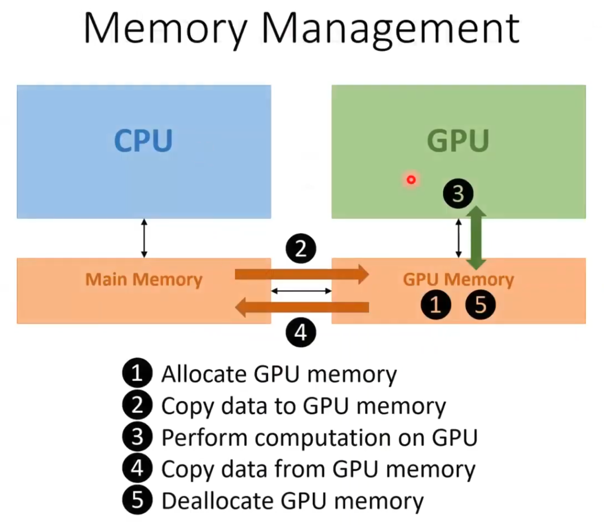
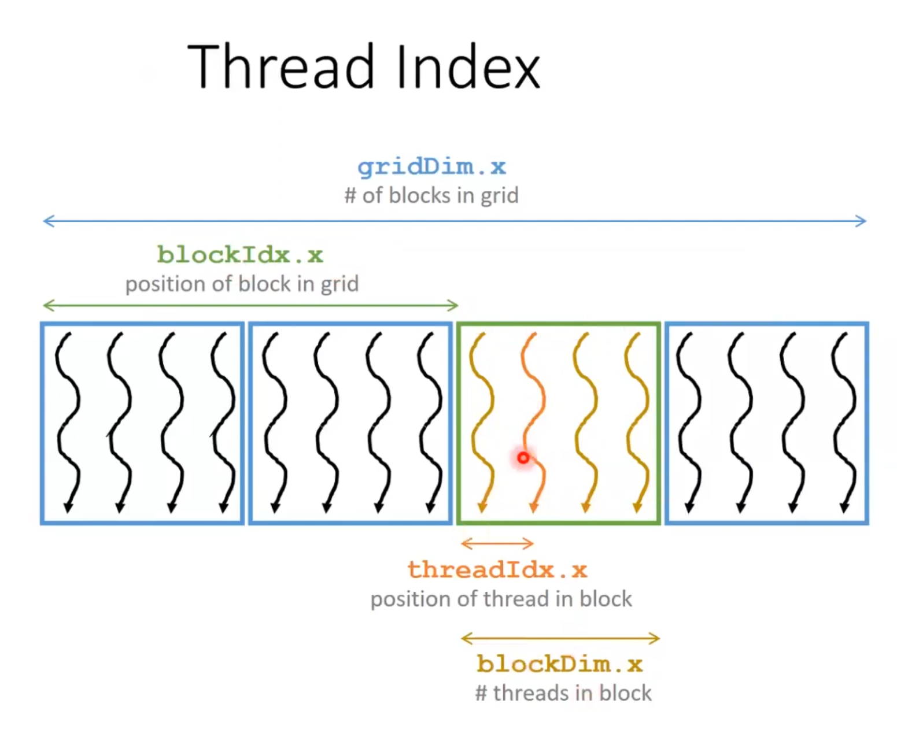
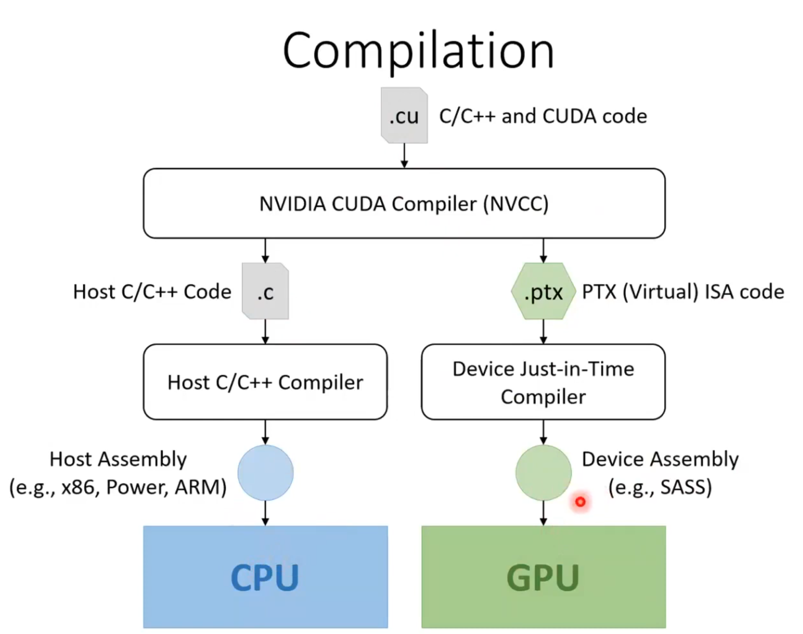

# How to Run `vec_add.cu`

This document explains how to compile and run the Vector Addition CUDA program.

## Prerequisites

- NVIDIA GPU
- CUDA Toolkit installed (specifically `nvcc` compiler)

## Compilation

To compile the code, use the `nvcc` compiler. Open your terminal and navigate to the directory containing `vec_add.cu`, then run:

```bash
nvcc vec_add.cu -o vec_add
```

This command compiles `vec_add.cu` and creates an executable named `vec_add`.

## Execution

To run the compiled program, execute the following command in your terminal:

```bash
./vec_add
```

## Expected Output

You should see output similar to the following, showing the execution time for both CPU and GPU implementations:

```text
CPU Execution Time: 0.090312 seconds
GPU Execution Time: 25.715008 milliseconds
```

*Note: Actual times will vary depending on your hardware.*

## Visual Aids

**CUDA Memory Management**: Explains the separation of Host (CPU) and Device (GPU) memory, and the use of API calls like `cudaMalloc` and `cudaMemcpy` to manage data transfer.


*CUDA Memory Management*

**2D CUDA Thread Indexing**: Illustrates the hierarchy of Grids, Blocks, and Threads, and how to calculate a unique global thread ID using `blockIdx`, `blockDim`, and `threadIdx`.


*2D CUDA Thread Indexing*

**NVCC Compiler**: Shows how the NVIDIA CUDA Compiler (`nvcc`) separates source code into host code (compiled by the host compiler like gcc) and device code (compiled by nvcc).


*NVCC Compiler*

**CUDA Function Declaration**: Details the function execution space qualifiers: `__global__` (runs on device, called from host), `__device__` (runs on device, called from device), and `__host__` (runs on host, called from host).


*CUDA Function Declaration*

## References

[CUDA Programming - Lecture 2](https://youtu.be/iE-xGWBQtH0?si=eB0dhyJT5MHvuEeL)
