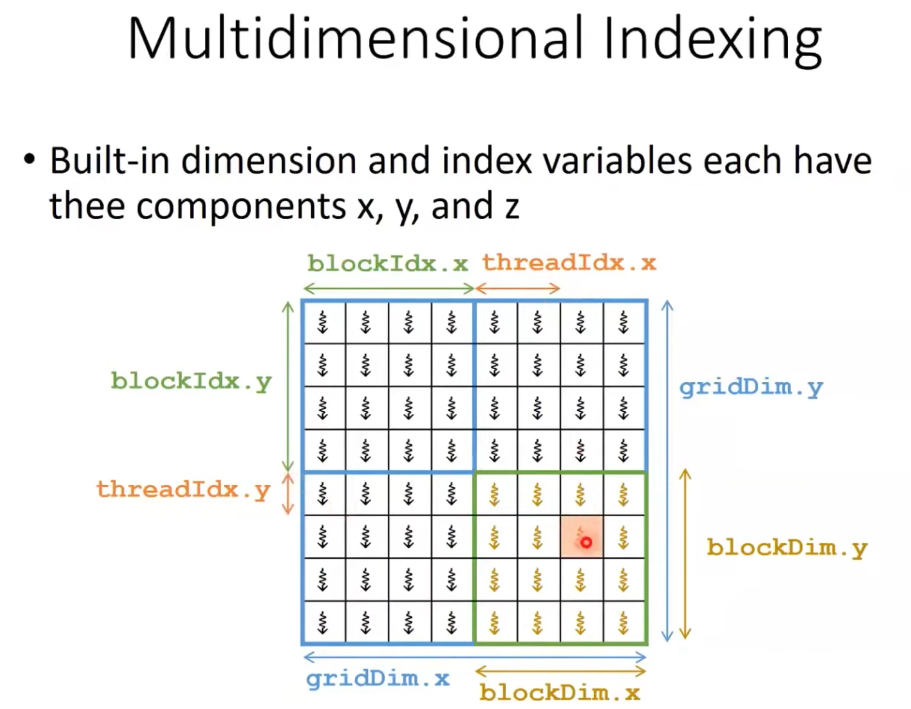
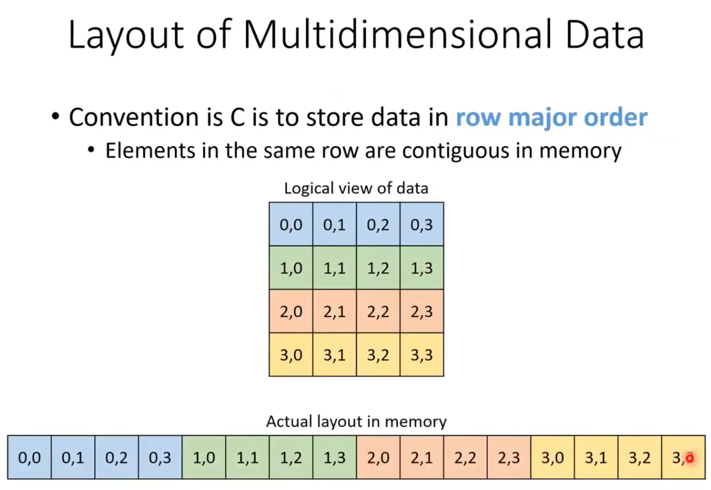

# GPU Programming with CUDA - Lecture 03

This directory contains CUDA examples for basic image processing tasks.

## Key Concepts

Understanding how to map 2D image coordinates to CUDA threads and linear memory is crucial for image processing on GPUs.

### 1. CUDA Multi-dimensional Indexing
CUDA allows checking the `blockIdx`, `blockDim`, and `threadIdx` to calculate global thread coordinates. For 2D images, we typically use a 2D grid of 2D blocks.



- `gridDim`: Dimensions of the grid (number of blocks).
- `blockDim`: Dimensions of each block (number of threads).
- `blockIdx`: Index of the current block within the grid.
- `threadIdx`: Index of the current thread within the block.

### 2. Row-Major Order
Although we visualize images as 2D grids of pixels, computer memory is linear (1D). Images are typically stored in **Column-Major Order** or **Row-Major Order** as in the image below, where all pixels of the first row are stored first, followed by the second row, and so on.



### 3. Accessing Multi-dimensional Data
To access a pixel at coordinate `(x, y)` in a 1D array, we must linearize the index.
  


The standard formula to map a generic thread `(tx, ty)` to a linear index `i` is:
```cpp
int idx = y * width + x;
```
For RGB images (3 channels), the memory stores R, G, B values consecutively, so the byte offset becomes:
```cpp
int idx = (y * width + x) * channels;
```

## Examples

### 1. Grayscale Conversion (`multi_dim.cu`)
Converts a color image (`lena.png`) to grayscale using a CUDA kernel.
- **Input**: `lena.png`
- **Output**: `lena_gpu.png` (GPU result), `lena_cpu.png` (CPU result for comparison)
- **Performance**: GPU is significantly faster.

### 2. Image Blur (`img_blur.cu`)
Applies a Box Blur (5x5 kernel) to an image.
- **Input**: `lena.png`
- **Output**: `lena_blur_gpu.png`, `lena_blur_cpu.png`
- **Performance**: GPU achieves massive speedup due to parallel convolution.

## Performance Comparison

| Task | GPU Time (ms) | CPU Time (ms) | Speedup |
| :--- | :--- | :--- | :--- |
| Grayscale Conversion | ~0.010 | ~0.407 | **~40x** |
| Image Blur (5x5) | ~0.051 | ~15.80 | **~310x** |

## Visual Results

### Grayscale Conversion
| Original | GPU Output | CPU Output |
| :---: | :---: | :---: |
|  |  |  |

### Image Blur
| Original | GPU Output | CPU Output |
| :---: | :---: | :---: |
|  |  |  |

## Building and Running

### Prerequisites
- NVIDIA GPU with CUDA Toolkit installed (`nvcc`).
- `stb_image.h` and `stb_image_write.h` (included/downloaded).

### Compile
Use the provided `Makefile`:
```bash
make
```
Or compile manually:
```bash
nvcc multi_dim.cu -o multi_dim
nvcc img_blur.cu -o img_blur
```

### Run
```bash
./multi_dim
./img_blur
```
