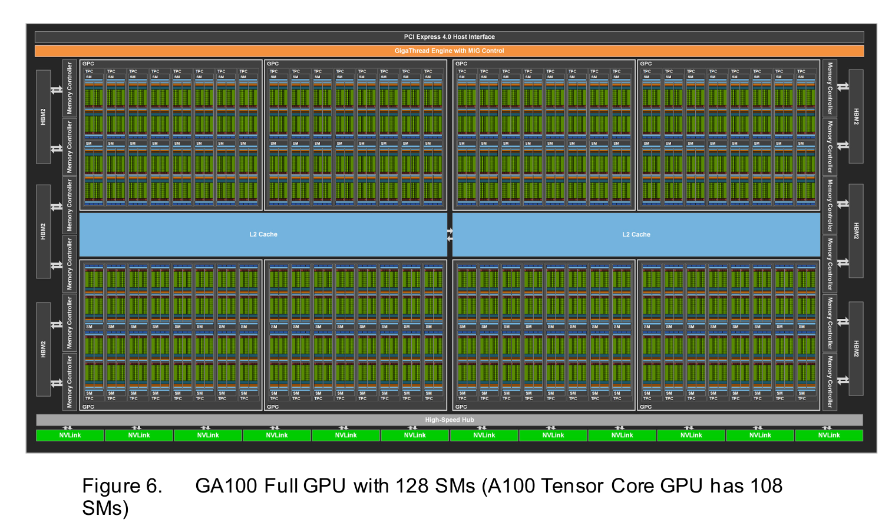
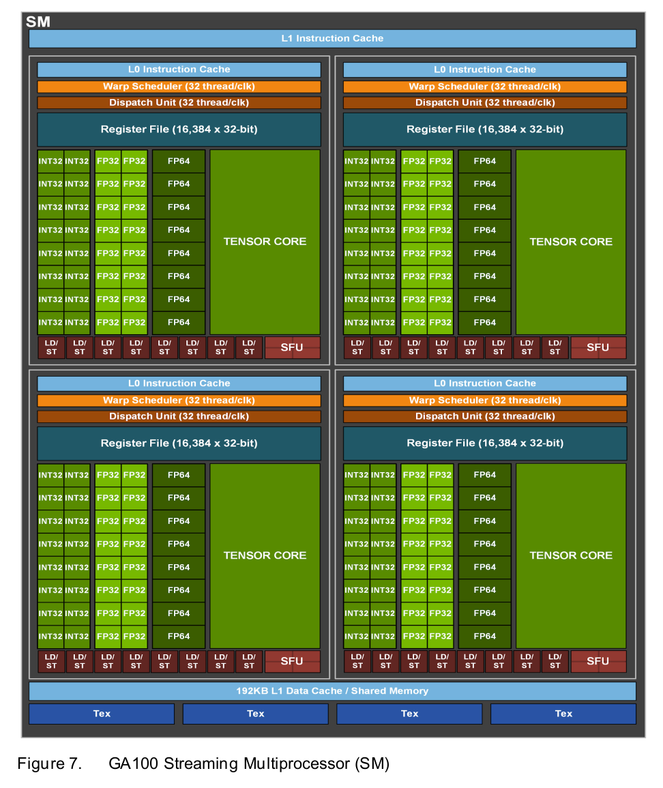
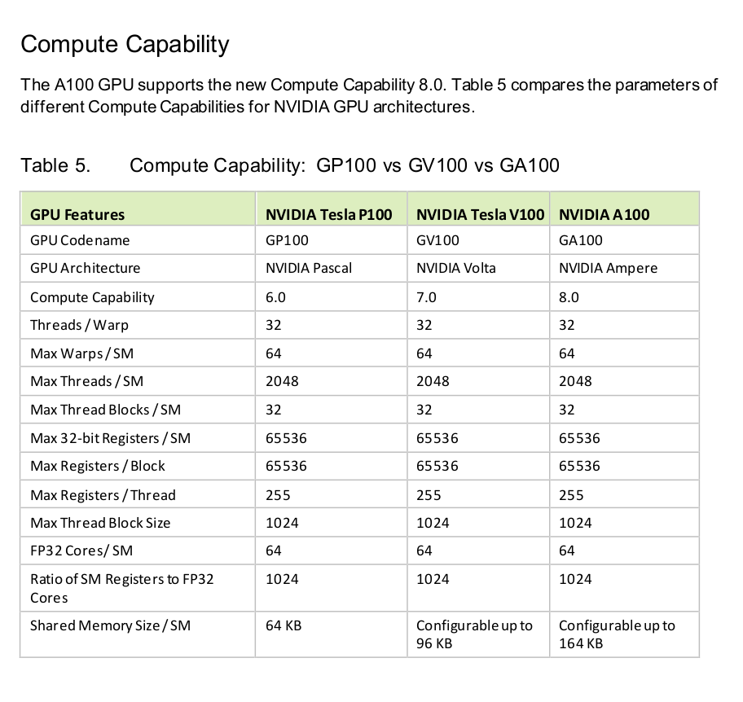
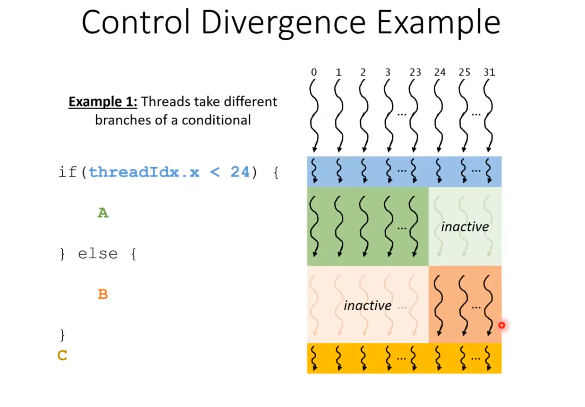
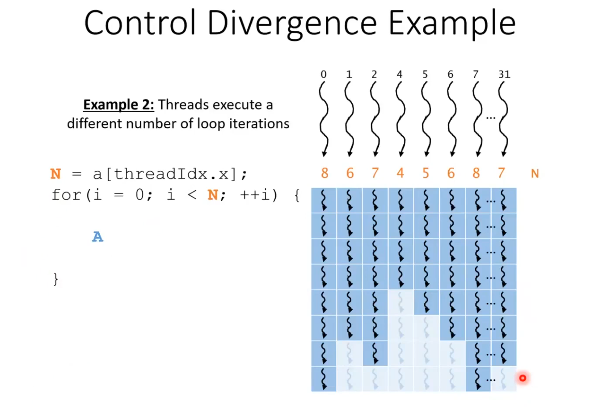
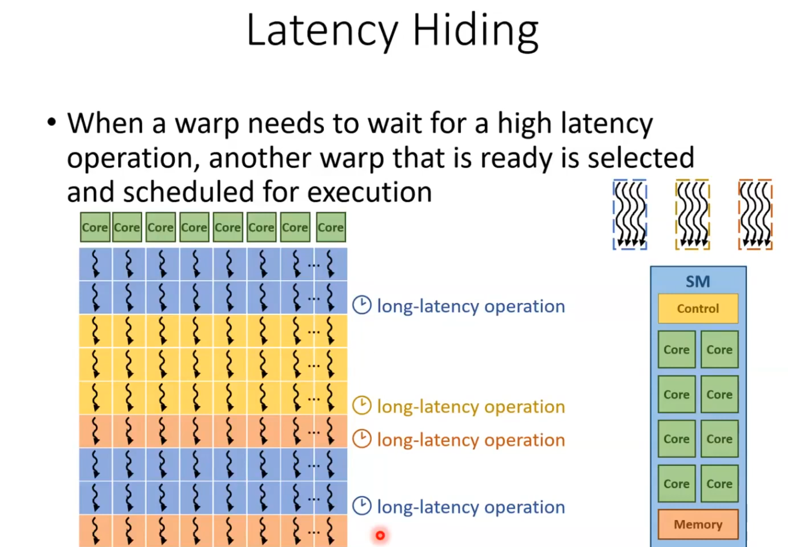

# Lecture 04: GPU Architecture and Control Divergence

This lecture covers the NVIDIA A100 GPU architecture, Streaming Multiprocessors (SM), Compute Capability, and the concept of Control Divergence and Latency Hiding.

## A100 GPU Architecture


**Description:**
Overview of the A100 GPU architecture, showing GPCs, SMs, and memory interfaces. This diagram illustrates the high-level organization of the GPU, including the number of GPCs and how they are connected to the L2 cache and memory controllers.

## Streaming Multiprocessor (SM)


**Description:**
Detailed view of a single Streaming Multiprocessor (SM) in the A100. It highlights the arrangement of CUDA Cores (FP32, FP64, INT32), Tensor Cores, and RT Cores, along with the register file and shared memory/L1 cache.

## Compute Capability


**Description:**
Comparison of different Compute Capabilities. This table or chart likely listing feature support (like atomic operations, warp shuffle functions, etc.) and hardware limits (max threads per block, shared memory size) across different GPU generations.

## Control Divergence
### Example 1


**Description:**
Illustration of control divergence where threads in a warp follow different execution paths (e.g., if-else branches). This visualizes how the hardware serializes execution of divergent paths, reducing overall efficiency.

### Example 2


**Description:**
Another example showing the impact of conditional statements on warp execution. It reinforces the concept that all threads in a warp execute the same instruction at the same time, or wait if they are not on the active path.

## Latency Hiding


**Description:**
Concept of latency hiding, where the warp scheduler switches between active warps to utilize execution units while others are stalled (e.g., waiting for global memory access). This is key to achieving high throughput on GPUs.


## Occupancy

Occupancy is a key metric in CUDA programming that represents the ratio of active warps on a Streaming Multiprocessor (SM) to the maximum number of warps that the SM can support. High occupancy is generally desirable as it allows the GPU to hide latency; when one warp is stalled (e.g., waiting for memory), the SM can switch to another eligible warp to keep the execution units busy.

### Theoretical Occupancy
Theoretical occupancy is the maximum possible occupancy restricted by the hardware resources (registers, shared memory) and the kernel configuration (block size). It serves as an upper bound.

**Factors Limiting Theoretical Occupancy:**
1.  **Registers per Thread:** Each thread requires a certain number of registers. If a kernel uses many registers, fewer threads can fit on the SM.
    *   *Example (Ampere):* The A100 SM has a 64K 32-bit register file. High register usage per thread directly reduces the number of concurrent warps.
2.  **Shared Memory per Block:** The amount of shared memory used by each block can also wrap effectively limit the number of blocks that can reside on an SM.
    *   *Example (Ampere):* An A100 (CC 8.0) SM has 164 KB of shared memory.
3.  **Block Size:** Very small blocks may not provide enough warps to fill an SM (due to the max blocks per SM limit, which is 32 on A100). Very large blocks might reduce scheduling flexibility.

### Achieved Occupancy
Achieved occupancy is the actual occupancy measured during kernel execution. It is often lower than theoretical occupancy due to runtime dynamics.

**Why Achieved < Theoretical?**
*   **Unbalanced Workloads:** If some blocks finish earlier than others, SMs may be left partially idle (tail effect).
*   **Memory Dependency Stalls:** Warps waiting for global memory cannot execute, and if all active warps are stalled, no instructions are issued.
*   **Instruction Fetch/Dispatch Latency:** Delays in the pipeline can prevent warps from being issue-ready.

### Maximizing Performance
While maximizing occupancy is a good heuristic, it is not the only goal.
*   **Latency Hiding:** Enough occupancy is needed to cover memory latency.
*   **Resource Trade-off:** Sometimes, reducing occupancy (e.g., to use more registers per thread for loop unrolling or caching) can actually improve overall performance if it reduces instruction count or memory traffic.

The A100 architecture introduces features like **Asynchronous Copy** (loading data from global to shared memory without blocking the CUDA cores) to further help hide latency even when occupancy is not maximal.

## Divergence Code Example
To practically demonstrate the impact of warp divergence, we implemented a benchmark comparing a divergent kernel with a non-divergent one.

**File:** [divergence.cu](divergence.cu)

**Code Logic:**
*   **Divergent Kernel:** Uses `if (data[idx] % 2 == 0)` to branch execution. Even threads multiply by 2, odd threads add 1. This causes the warp to execute both paths sequentially.
*   **Non-Divergent Kernel:** Uses arithmetic operations `(isEven * ...)` + `(!isEven * ...)` to achieve the same result without control flow instructions, effectively "flattening" the branches.

**Performance Results:**
Running the benchmark with ~1 million elements shows a significant performance gap. The non-divergent version is consistently **3x - 5x faster**, illustrating the cost of serialization due to divergence.

```text
Running benchmark with 1048576 elements...
divergenceKernel took 0.055712 milliseconds
------------------------------------------------
withoutDivergenceKernel took 0.017568 milliseconds
------------------------------------------------
Performance: 
  Speedup: 3.17x faster
  Execution Time Reduction: 68.47%
```


## Occupancy Code Example
We explored how to optimize occupancy using the CUDA Occupancy API.

**Files:**
*   [occupancy.cu](occupancy.cu): Demonstrates using `cudaOccupancyMaxPotentialBlockSize` to calculate the optimal block size for a specific kernel.
*   [device_occupancy.cu](device_occupancy.cu): A utility to query all available GPUs and calculate theoretical optimal occupancy parameters.

**Profiling Results (Nsight Compute):**
Using `ncu`, we can verify that our calculated block size aims for 100% theoretical occupancy. However, achieved occupancy may vary due to runtime factors and will be disscused in performance lecture.

```text
Calculated Optimal Execution Parameters:
  Recommended Block Size: 768
  Minimum Grid Size: 112
  Actual Grid Size used: 21846

Section: Occupancy
------------------------------- ----------- ------------
Metric Name                     Metric Unit Metric Value
------------------------------- ----------- ------------
Block Limit SM                        block           24
Block Limit Registers                 block            5
Block Limit Shared Mem                block            8
Block Limit Warps                     block            2
Theoretical Active Warps per SM        warp           48
Theoretical Occupancy                     %          100
Achieved Occupancy                        %        65.76
Achieved Active Warps Per SM           warp        31.56
------------------------------- ----------- ------------
```

## References
*   [NVIDIA Ampere Architecture Whitepaper](https://images.nvidia.com/aem-dam/en-zz/Solutions/data-center/nvidia-ampere-architecture-whitepaper.pdf)
*   [YouTube: Lecture 04 - GPU Architecture](https://youtu.be/pBQJAwogMoE?si=3-jyrl9iUAR4OQLN)
*   [YouTube: Lecture 8 - CUDA Performance Checklist](https://youtu.be/SGhfUhlowB4?si=LtyggEkk85xesy7g)