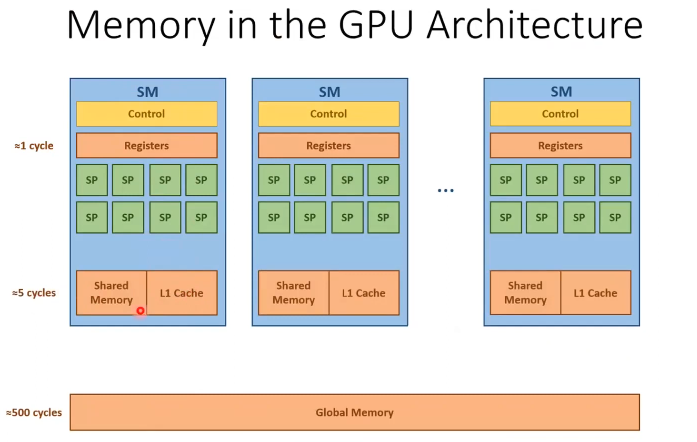
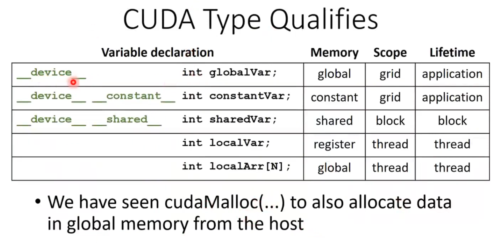
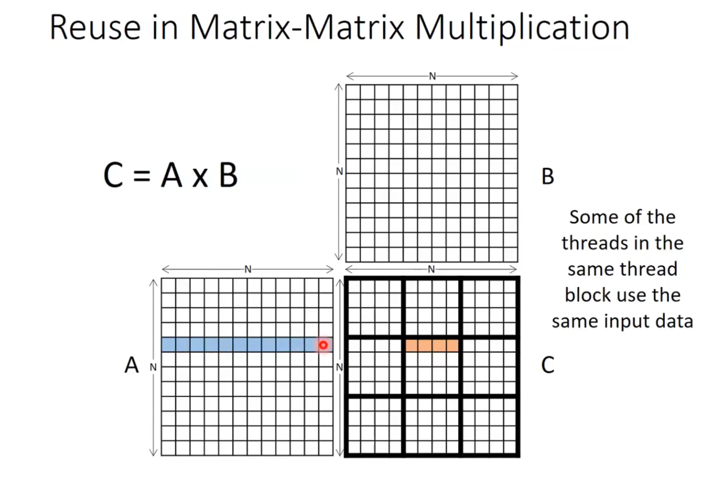
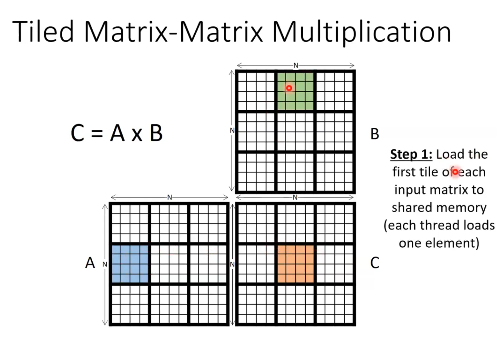
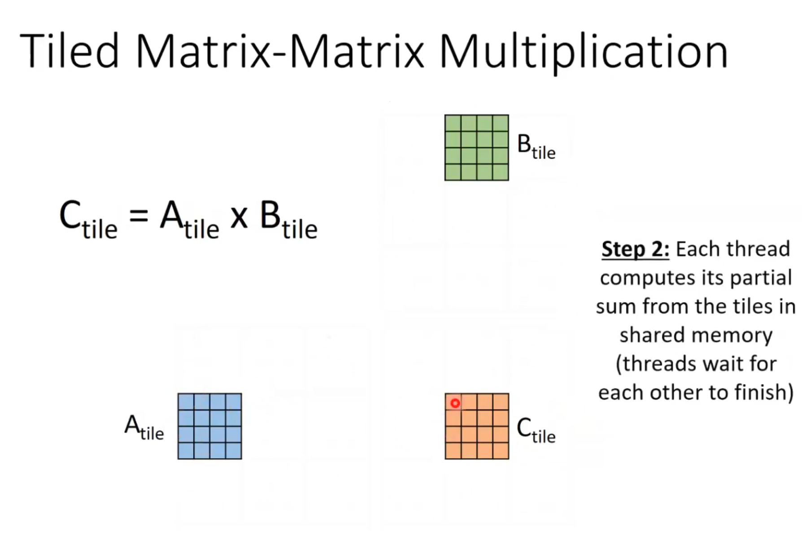

# Lecture 05: Memory and Tiling

This lecture covers the CUDA memory hierarchy and the technique of **Tiling** (or blocking) to optimize memory access patterns, specifically for Matrix Multiplication.

## 1. GPU Memory Hierarchy

Understanding the memory hierarchy is crucial for writing efficient CUDA programs. The GPU has different types of memory with varying speeds and scopes.

- **Registers**: Fastest memory, private to each thread.
- **Shared Memory**: Fast on-chip memory, shared by threads within the same block. Usage is user-managed.
- **Global Memory**: Large off-chip memory (DRAM), accessible by all threads but has high latency.
- **Constant/Texture Memory**: Read-only specialized caches.

## 2. CUDA Variable Type Qualifiers

CUDA provides specific type qualifiers to declare where variables reside in memory and their scope.

- `__device__`: Stored in global memory, accessible from the device.
- `__constant__`: Stored in constant memory.
- `__shared__`: Stored in shared memory, visible to the thread block.

## 3. Matrix Multiplication: Naive Approach

The standard matrix multiplication algorithm computes each element of the result matrix $C$ by taking the dot product of a row from $A$ and a column from $B$.

In the naive implementation, every thread reads an entire row of $A$ and an entire column of $B$ from global memory. This results in redundant memory accesses because many threads read the same values from $A$ and $B$.

## 4. Tiled Matrix Multiplication

**Tiling** is an optimization technique used to reduce global memory bandwidth usage. The idea is to partition the data into smaller subsets (tiles) that fit into **Shared Memory**.

### How it works:
1.  Threads cooperate to load a subset (tile) of $A$ and $B$ into Shared Memory.
2.  `__syncthreads()` is called to ensure all data is loaded.
3.  Threads compute the partial product using the data in fast Shared Memory.
4.  Repeat for all tiles.

By using shared memory, we reduce the number of accesses to the slow global memory, as data loaded into shared memory can be reused by multiple threads.

**Reference Lecture:** [Youtube Video](https://youtu.be/31ZyYkoClT4?si=XjZa3P9NZAISWHvl)