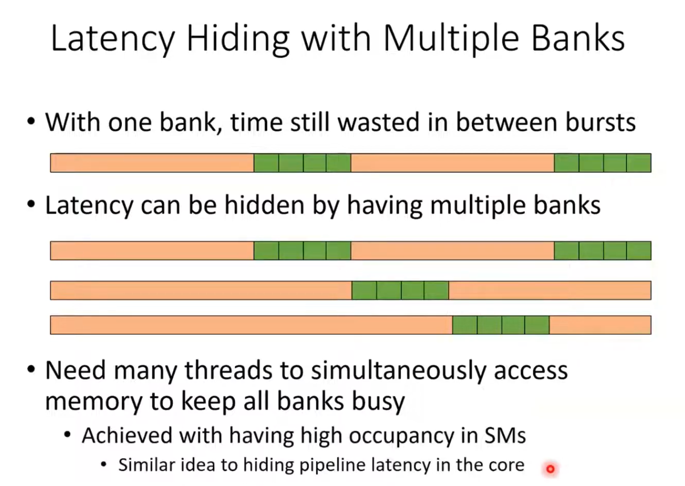

# Lecture 06: Performance Considerations

This lecture covers critical performance limiters in CUDA programming and strategies to overcome them, specifically focusing on how memory access patterns and work distribution affect kernel execution speed.

## Memory Coalescing

Memory coalescing is one of the most important performance optimizations in CUDA. It refers to the pattern in which threads in a warp access global memory.

When threads in a warp access a contiguous block of memory, the hardware can combine (coalesce) these accesses into a single transaction. This is similar to a cache line fill in CPU architectures but applied to the SIMT (Single Instruction, Multiple Threads) model of GPUs.

- **Coalesced Access**: If thread `i` accesses `data[i]` and thread `i+1` accesses `data[i+1]`, the hardware fetches a chunk of memory that satisfies the needs of all threads in the warp in one go.
- **Uncoalesced Access**: If accesses are strided or random (e.g., thread `i` accesses `data[i * stride]`), the hardware may need to issue multiple separate memory transactions for a single warp instruction, drastically reducing effective memory bandwidth.

**Code Example:** [coalesce.cu](coalesce.cu) demonstrates the performance difference between coalesced and uncoalesced (strided) memory access.

## Thread Coarsening

Thread coarsening involves assigning more work to each thread. Instead of having one thread process a single data element (fine-grained), a single thread processes multiple elements (coarse-grained).

**Benefits:**
1.  **Reduced Overhead**: Fewer threads mean less overhead for thread creation and management.
2.  **Instruction Reuse**: Common instructions (like address calculations) can be reused for multiple data elements.
3.  **Register Pressure**: Can sometimes help tune register usage per SM.
4.  **Hiding Latency**: With more independent work per thread, the compiler has more opportunities to reorder instructions to hide pipeline and memory latencies.

**Code Example:** [coarsening.cu](coarsening.cu) benchmarks a fine-grained kernel against a coarsened kernel where each thread processes multiple elements.

## Latency Hiding

Latency hiding is the process of keeping the execution units of the SM busy while some warps are stalled waiting for long-latency operations (like global memory fetches).

The GPU scheduler switches context between active warps with zero overhead. If Warp A is waiting for data from memory, the scheduler instantly switches to Warp B which is ready to execute arithmetic instructions.

As shown in the image above, sufficient occupancy (enough active warps) allows the hardware to "cover" the latency of memory operations with useful compute work from other warps.

## References

- [Part 1: Performance Considerations, Memory Coalescing](https://youtu.be/SGhfUhlowB4?si=tvmzxvJoDnUDD2AO)
- [Part 2: Performance Considerations, Thread Coarsening](https://youtu.be/DA-_EK8PbTY?si=wkRSskdOsD8sWvvO)