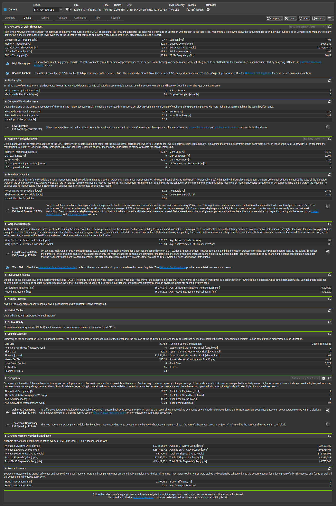
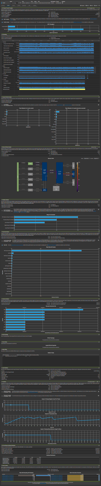

# Lecture 07: Profiling

This lecture covers how to identify performance bottlenecks in your kernels using profiling tools.

## Profiling Methods

There are different ways to profile a kernel:

1.  **CLI with `ncu` (NVIDIA Nsight Compute)**: The modern command-line profiler. (there are different APIs I will only explain the nsight compute GUI)
2.  **GUI with Nsight Compute**: A visual interface for detailed analysis.
3.  *(Deprecated)* CLI with `nvprof`: Older tool, not recommended for newer architectures.

We will use the `vecadd` example to demonstrate profiling.

## Part 1: CLI Profiling with `ncu`

We will first look at how to profile a kernel from the command line using `ncu`.

### Steps

1.  **Compile the kernel**:
    ```bash
    nvcc vecadd.cu -o vecadd
    ```

2.  **Profile the kernel**:
    ```bash
    ncu ./vecadd
    ```

### Terminal Result

When running the `vecadd` program, you will see the execution time comparison between CPU and GPU. `ncu` will attach to the process to collect profiling data.

```text
CPU Execution Time: 0.102179 seconds
==PROF== Connected to process 20858 (/home/robot101/cuda_udemy/cuda_youtube/GPU_programming-CUDA-/Lecture_07/vecadd)
==PROF== Profiling "vec_add_gpu" - 0: 0%....50%....100% - 8 passes
GPU Execution Time: 427.412170 milliseconds
==PROF== Disconnected from process 20858
[20858] vecadd@127.0.0.1
  vec_add_gpu(int *, int *, int *, int) (32768, 1, 1)x(1024, 1, 1), Context 1, Stream 7, Device 0, CC 8.9
    Section: GPU Speed Of Light Throughput
    ----------------------- ----------- ------------
    Metric Name             Metric Unit Metric Value
    ----------------------- ----------- ------------
    DRAM Frequency                  Ghz        10.49
    SM Frequency                    Ghz         1.98
    Elapsed Cycles                cycle    1,865,453
    Memory Throughput                 %        89.18
    DRAM Throughput                   %        89.18
    Duration                         us       942.18
    L1/TEX Cache Throughput           %        10.22
    L2 Cache Throughput               %        21.59
    SM Active Cycles              cycle 2,035,286.64
    Compute (SM) Throughput           %         8.08
    ----------------------- ----------- ------------

    INF   This workload is utilizing greater than 80.0% of the available compute or memory performance of the device.   
          To further improve performance, work will likely need to be shifted from the most utilized to another unit.   
          Start by analyzing DRAM in the Memory Workload Analysis section.                                              

    Section: Launch Statistics
    -------------------------------- --------------- ---------------
    Metric Name                          Metric Unit    Metric Value
    -------------------------------- --------------- ---------------
    Block Size                                                 1,024
    Function Cache Configuration                     CachePreferNone
    Grid Size                                                 32,768
    Registers Per Thread             register/thread              16
    Shared Memory Configuration Size           Kbyte            8.19
    Driver Shared Memory Per Block       Kbyte/block            1.02
    Dynamic Shared Memory Per Block       byte/block               0
    Static Shared Memory Per Block        byte/block               0
    # SMs                                         SM              56
    Stack Size                                                 1,024
    Threads                                   thread      33,554,432
    # TPCs                                                        28
    Enabled TPC IDs                                              all
    Uses Green Context                                             0
    Waves Per SM                                              585.14
    -------------------------------- --------------- ---------------

    Section: Occupancy
    ------------------------------- ----------- ------------
    Metric Name                     Metric Unit Metric Value
    ------------------------------- ----------- ------------
    Block Limit SM                        block           24
    Block Limit Registers                 block            4
    Block Limit Shared Mem                block            8
    Block Limit Warps                     block            1
    Theoretical Active Warps per SM        warp           32
    Theoretical Occupancy                     %        66.67
    Achieved Occupancy                        %        40.94
    Achieved Active Warps Per SM           warp        19.65
    ------------------------------- ----------- ------------

    OPT   Est. Local Speedup: 38.59%                                                                                    
          The difference between calculated theoretical (66.7%) and measured achieved occupancy (40.9%) can be the      
          result of warp scheduling overheads or workload imbalances during the kernel execution. Load imbalances can   
          occur between warps within a block as well as across blocks of the same kernel. See the CUDA Best Practices   
          Guide (https://docs.nvidia.com/cuda/cuda-c-best-practices-guide/index.html#occupancy) for more details on     
          optimizing occupancy.                                                                                         
    ----- --------------------------------------------------------------------------------------------------------------
    OPT   Est. Local Speedup: 33.33%                                                                                    
          The 8.00 theoretical warps per scheduler this kernel can issue according to its occupancy are below the       
          hardware maximum of 12. This kernel's theoretical occupancy (66.7%) is limited by the number of warps within  
          each block.                                                                                                   

    Section: GPU and Memory Workload Distribution
    -------------------------- ----------- ------------
    Metric Name                Metric Unit Metric Value
    -------------------------- ----------- ------------
    Average DRAM Active Cycles       cycle    8,815,224
    Total DRAM Elapsed Cycles        cycle   59,308,032
    Average L1 Active Cycles         cycle 2,035,286.64
    Total L1 Elapsed Cycles          cycle  103,771,848
    Average L2 Active Cycles         cycle 1,611,833.62
    Total L2 Elapsed Cycles          cycle   39,343,824
    Average SM Active Cycles         cycle 2,035,286.64
    Total SM Elapsed Cycles          cycle  103,771,848
    Average SMSP Active Cycles       cycle 1,650,332.10
    Total SMSP Elapsed Cycles        cycle  415,087,392
    -------------------------- ----------- ------------

```

*Note: The GPU execution time is significantly faster (approx 1ms vs 130ms for CPU), showcasing the massive parallelism.*

## Part 2: GUI Profiling with Nsight Compute

In this section, we will see how to profile the kernel using the Nsight Compute GUI, which provides a rich visual analysis of kernel performance.

### Steps to Profile

1.  **Open Nsight Compute** (`ncu-ui` from terminal or launch from your desktop environment).
2.  **Create New Project**: Click on "Quick Launch" or "New Project".
3.  **Configure Launch**:
    -   **Target Application**: Browse and select your compiled `vecadd` executable.
    -   **Working Directory**: Set it to the folder containing the executable.
    -   **Command Line Arguments**: (Leave empty for this example).
4.  **Launch Profiling**: Click "Launch". The application will run, and Nsight Compute will capture the performance data.

### Watch the Demonstration

<video src="images/nsight_compute_video.webm" width="800" controls>
  Your browser does not support the video tag.
</video>

### Analyzing Results

Once the profiling is complete, you will see a detailed report.

#### Dashboard View
The dashboard provides high-level metrics like Compute and Memory throughput.



#### Detailed Analysis
You can drill down into specific sections like "GPU Speed Of Light" to see if your kernel is Compute Bound or Memory Bound.

