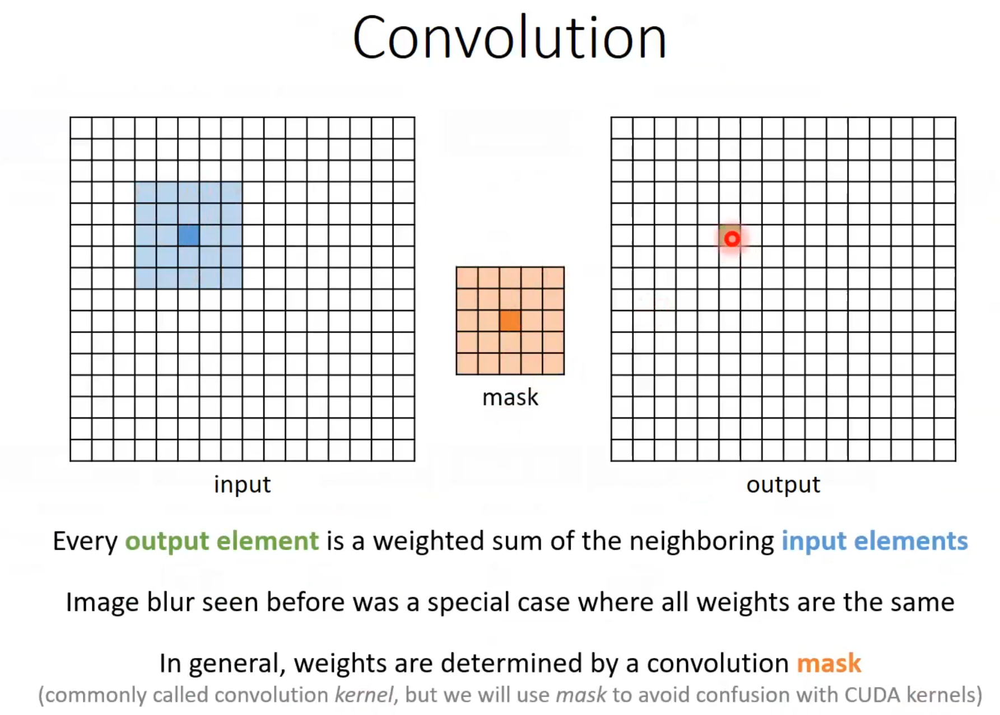
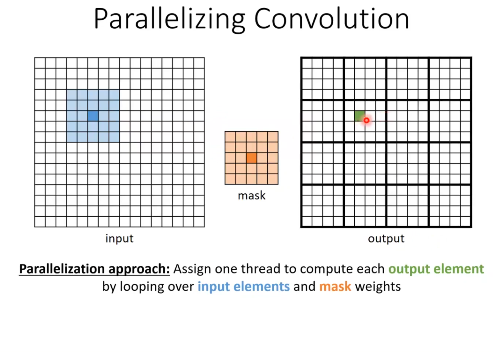
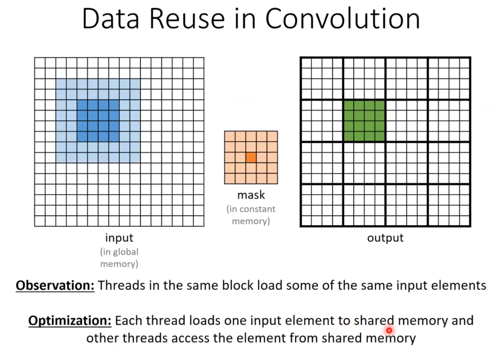

# Lecture 8: 2D Convolution

This lecture covers the implementation of a 2D convolution operation on both the CPU and GPU. This is widely used in Image Processing.

## Key Concepts
- **2D Convolution**: Applying a mask (kernel) to a 2D image.
- **Mask (Kernel)**: A small 2D matrix of weights (e.g., 7x7) that slides over the input image.
- **Global Memory Access**: The basic GPU implementation performs 2D indexing (`y * width + x`).
- **Halo Elements**: The boundary pixels required by the mask.



## Implementation Details
The project is refactored into multiple files:
- **`main.cu`**: Entry point; initializes a 1024x1024 image and 7x7 mask.
- **`config.h`**: Dimensions and constants (`MASK_WIDTH=7`, `TILE_WIDTH=16`).
- **`convolution_cpu.cu`**: Reference 2D CPU implementation.
- **`convolution_global.cu`**: Basic 2D kernel.
- **`convolution_constant.cu`**: 2D kernel using Constant Memory for the mask.
- **`convolution_tiled.cu`**: 2D kernel using Shared Memory tiling.



### Optimization Strategies
1.  **Constant Memory**: Best for Read-Only data broadcast to many threads (like the Mask).
2.  **Tiling (Shared Memory)**: Best for data reuse. Each block loads a "Tile" of input + halo into fast shared memory.



## Compilation and Execution

A `Makefile` is provided.

To compile:
```bash
make
```

To run:
```bash
./convolution
```

To clean:
```bash
make clean
```

## Expected Output

### Sample Execution Results (1024x1024 Image, 7x7 Mask)
| Implementation | Execution Time | Speedup vs CPU | Notes |
| :--- | :--- | :--- | :--- |
| **CPU** | ~18.368 ms | 1.0x | Reference |
| **Basic GPU** | ~0.052 ms | ~350x | Efficient L1 caching |
| **Constant GPU** | ~0.044 ms | ~414x | **Fastest**. Constant cache optimal for 2D broadcast. |
| **Tiled GPU** | ~12.622 ms | ~1.46x | High overhead for small 16x16 tiles vs simple cache |

```
CPU Time: ... ms
Basic GPU Time: ... ms
Basic Speedup: ...x
Basic GPU PASSED
Constant GPU Time: ... ms
Constant Speedup: ...x
Constant GPU PASSED
Tiled GPU Time: ... ms
Tiled Speedup: ...x
Tiled GPU PASSED
```

### Performance Analysis
- **Constant Memory Wins**: For a 7x7 2D mask, the Constant Cache provides the best throughput as every thread in the warp reads the same mask value inner-loop.
- **Tiling Overhead**: Explicitly managing 2D shared memory tiles with small dimensions (16x16) introduces significant instruction overhead (index calculation, boundary checks, synchronization) compared to relying on the hardware L2 cache which handles 2D spatial locality very well for the Basic/Constant kernels. Tiling would improve relative performance for much larger images or larger masks.

## References
- [Lecture 8 - Tiled Convolution](https://youtu.be/xEVyTZG1wlk?si=hrL0SwJAzuuFIhLJ)
